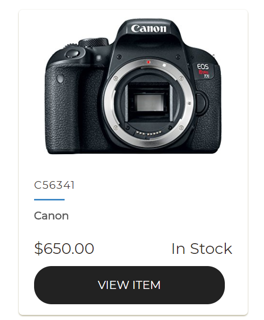

# CameraStore 

## Contributors
 Pradeep Devarabetta Mallikarjun

## Synopsis
 An online Camera retail store that allows customers to browse and purchase products online.

## Work flow
  - User can browse the items without login 
  - Clicking on a product will direct to a new page where the product information will be displayed.
  - User can add the product to the cart from the main page or from the product page where the prodcut info is displayed
  - Clicking on checkout will take you to the checkout page where all the products and the total cart price would be shown.
  - User can add/remove items to the item cart and the total items in the cart would be updated automatically based on the user input.
  - Clicking on the place order will take you to User info page where the user info and the card details are collected.
  - Click on place order will display a Modal box that shows all the information about the purchase before the customer confirms the order.
  - Order Summary page is where the order Id and all the details such as the date of arrival and all other information will be displayed.
  
## Technologies 
 - UI: HTML5, CSS, Bootstrap, JQuery, Javascript 
 - Core: AJAX, MySQL, REST, Perl 

## Screenshots

   
  
  
  
   
  
  
  
  
  
  
  
  
## License
MIT